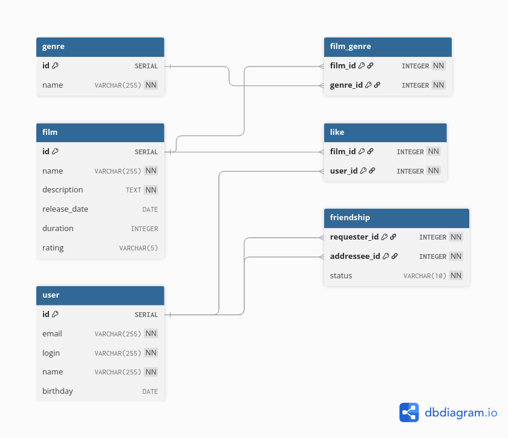

# java-filmorate
Template repository for Filmorate project.


# Queries
## Get friends by user id
```
SELECT *
FROM "user" 
WHERE id IN (
  SELECT addressee_id AS id
  FROM friendship
  WHERE requester_id = {insert id}
  AND status = 'CONFIRMED'
  UNION
  SELECT requester_id AS id
  FROM friendship
  WHERE addressee_id = {insert id}
  AND status = 'CONFIRMED'
);
```

## insert new user
```
INSERT INTO "user" (email, login, name, birthday) VALUES 
('email', 'login', 'name', '1995-05-10');
```

## insert new film
```
INSERT INTO film (name, description, release_date, duration, rating) VALUES 
('name', 'description', '2010-07-16', 148, 'PG-13');
```

## Get most popular films
```
SELECT f.*
FROM film as f
LEFT JOIN "like" AS l ON l.film_id = f.id
GROUP BY f.id
ORDER BY COUNT(*) DESC
LIMIT 10;
```
